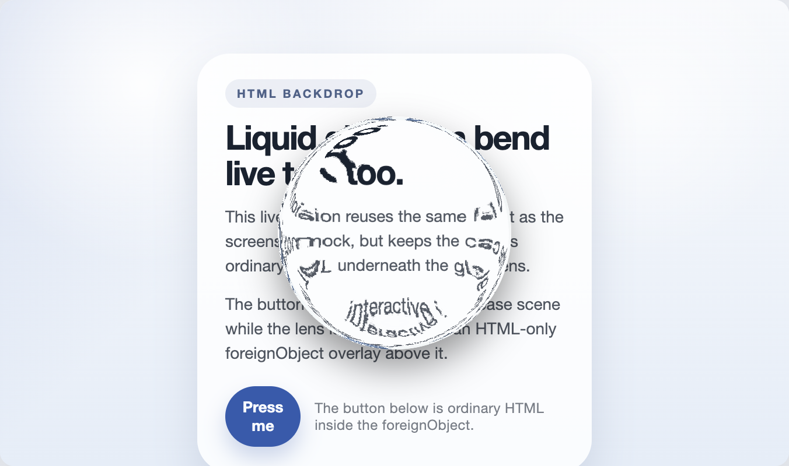

# HTML Liquid Glass

Recreations of and experiments on ideas from [Liquid Glass in the Browser: Refraction with CSS and SVG](https://kube.io/blog/liquid-glass-css-svg) by kube.io, using SVG `<foreignObject>` elements instead of CSS `backdrop-filter` for cross-browser compatibility.

Currently working in Chrome, Edge, and Firefox, but not Safari.
